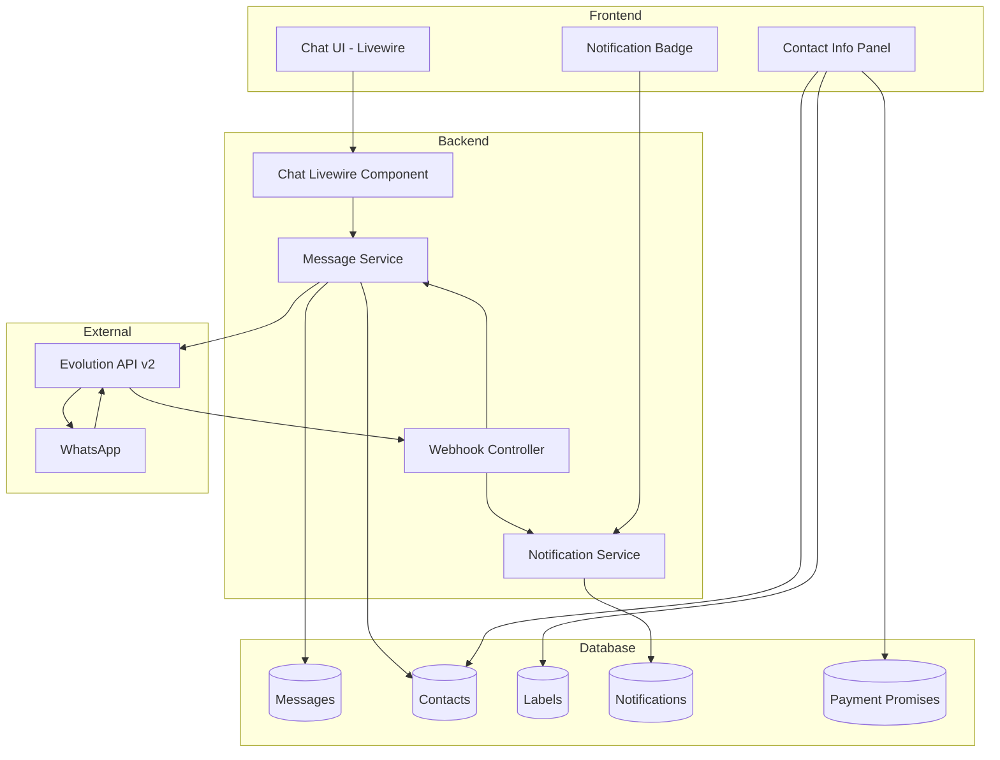

# Design Document: Chat Module

## Overview

El módulo de Chat de WhatsApp para ASESCO BPO proporciona una interfaz de mensajería integrada que permite a los usuarios gestionar conversaciones a través de canales de WhatsApp asignados. El sistema se integra con Evolution API v2 para el envío y recepción de mensajes, e incluye funcionalidades específicas para operaciones de cobranza como etiquetas de clasificación, acciones rápidas y seguimiento de promesas de pago.

### Key Features
- Interfaz de chat estilo WhatsApp con burbujas de mensajes
- Filtrado automático por canales asignados al usuario
- Sistema de notificaciones en tiempo real
- Etiquetas para clasificación de contactos
- Acciones rápidas para flujo de cobranza
- Panel de información del contacto
- Webhooks para recepción de mensajes

## Architecture



## Components and Interfaces

### Livewire Components

#### 1. Chat\Index Component
Componente principal que muestra la lista de conversaciones y el área de chat.

```php
namespace App\Livewire\Chat;

class Index extends Component
{
    // Properties
    public ?int $selectedChannelId = null;
    public ?int $selectedContactId = null;
    public string $search = '';
    public ?string $labelFilter = null;
    public string $messageText = '';
    
    // Computed
    public function getChannelsProperty(): Collection;
    public function getConversationsProperty(): Collection;
    public function getMessagesProperty(): Collection;
    public function getSelectedContactProperty(): ?Contact;
    
    // Actions
    public function selectChannel(int $channelId): void;
    public function selectConversation(int $contactId): void;
    public function sendMessage(): void;
    public function loadMoreMessages(): void;
    public function markAsRead(int $contactId): void;
    
    // Event Listeners
    #[On('new-message')]
    public function handleNewMessage(array $data): void;
}
```

#### 2. Chat\ContactInfo Component
Panel lateral con información del contacto.

```php
namespace App\Livewire\Chat;

class ContactInfo extends Component
{
    public Contact $contact;
    public bool $editing = false;
    public string $editName = '';
    public string $editNotes = '';
    
    public function updateContact(): void;
    public function addLabel(string $label): void;
    public function removeLabel(string $label): void;
}
```

#### 3. Chat\QuickActions Component
Acciones rápidas para flujo de cobranza.

```php
namespace App\Livewire\Chat;

class QuickActions extends Component
{
    public Contact $contact;
    public int $channelId;
    
    // Modal states
    public bool $showPromiseModal = false;
    public bool $showFollowUpModal = false;
    
    // Promise form
    public ?string $promiseDate = null;
    public ?float $promiseAmount = null;
    
    // Follow-up form
    public ?string $followUpDate = null;
    public string $followUpNote = '';
    
    public function registerPromise(): void;
    public function markAsPaid(): void;
    public function scheduleFollowUp(): void;
    public function sendReminder(): void;
}
```

#### 4. Chat\NotificationBadge Component
Badge de notificaciones en el header.

```php
namespace App\Livewire\Chat;

class NotificationBadge extends Component
{
    public int $unreadCount = 0;
    public Collection $notifications;
    
    public function getListeners(): array;
    public function loadNotifications(): void;
    public function markAsRead(int $notificationId): void;
    public function navigateToConversation(int $contactId, int $channelId): void;
}
```

### Services

#### MessageService
Servicio para gestión de mensajes.

```php
namespace App\Services;

class MessageService
{
    public function __construct(
        private EvolutionApiService $evolutionApi
    ) {}
    
    public function sendTextMessage(int $channelId, string $phoneNumber, string $text): Message;
    public function processIncomingMessage(array $webhookData): Message;
    public function getConversationMessages(int $contactId, int $channelId, int $limit = 50, ?int $beforeId = null): Collection;
    public function markMessagesAsRead(int $contactId, int $channelId): void;
}
```

#### NotificationService
Servicio para gestión de notificaciones.

```php
namespace App\Services;

class NotificationService
{
    public function createMessageNotification(Message $message): Notification;
    public function getUnreadCount(int $userId): int;
    public function getUserNotifications(int $userId, int $limit = 20): Collection;
    public function markAsRead(int $notificationId): void;
    public function markConversationAsRead(int $userId, int $contactId, int $channelId): void;
}
```

### Controllers

#### WebhookController
Controlador para recibir webhooks de Evolution API.

```php
namespace App\Http\Controllers;

class WebhookController extends Controller
{
    public function handleEvolutionWebhook(Request $request): JsonResponse;
    private function processMessageReceived(array $data): void;
    private function processMessageStatus(array $data): void;
}
```

## Data Models

### Contact Model
```php
class Contact extends Model
{
    protected $fillable = [
        'channel_id',
        'phone_number',
        'name',
        'push_name',      // Nombre de WhatsApp
        'profile_picture',
        'notes',
        'labels',         // JSON array
        'metadata',       // JSON object
    ];
    
    protected $casts = [
        'labels' => 'array',
        'metadata' => 'array',
    ];
    
    // Relationships
    public function channel(): BelongsTo;
    public function messages(): HasMany;
    public function paymentPromises(): HasMany;
    public function followUps(): HasMany;
    
    // Accessors
    public function getDisplayNameAttribute(): string;
    public function getUnreadCountAttribute(): int;
    public function getLastMessageAttribute(): ?Message;
}
```

### Message Model
```php
class Message extends Model
{
    protected $fillable = [
        'contact_id',
        'channel_id',
        'message_id',      // ID de Evolution API
        'direction',       // 'incoming' | 'outgoing'
        'type',            // 'text' | 'image' | 'document' | 'audio' | 'video'
        'content',
        'media_url',
        'media_mime_type',
        'status',          // 'pending' | 'sent' | 'delivered' | 'read' | 'failed'
        'is_read',
        'metadata',
        'sent_at',
    ];
    
    protected $casts = [
        'is_read' => 'boolean',
        'metadata' => 'array',
        'sent_at' => 'datetime',
    ];
    
    // Relationships
    public function contact(): BelongsTo;
    public function channel(): BelongsTo;
}
```

### Notification Model
```php
class Notification extends Model
{
    protected $fillable = [
        'user_id',
        'contact_id',
        'channel_id',
        'message_id',
        'type',           // 'new_message'
        'title',
        'body',
        'is_read',
        'read_at',
    ];
    
    protected $casts = [
        'is_read' => 'boolean',
        'read_at' => 'datetime',
    ];
    
    // Relationships
    public function user(): BelongsTo;
    public function contact(): BelongsTo;
    public function channel(): BelongsTo;
    public function message(): BelongsTo;
}
```

### PaymentPromise Model
```php
class PaymentPromise extends Model
{
    protected $fillable = [
        'contact_id',
        'user_id',
        'promised_date',
        'promised_amount',
        'status',         // 'pending' | 'fulfilled' | 'broken'
        'notes',
        'fulfilled_at',
    ];
    
    protected $casts = [
        'promised_date' => 'date',
        'promised_amount' => 'decimal:2',
        'fulfilled_at' => 'datetime',
    ];
    
    // Relationships
    public function contact(): BelongsTo;
    public function user(): BelongsTo;
}
```

### FollowUp Model
```php
class FollowUp extends Model
{
    protected $fillable = [
        'contact_id',
        'user_id',
        'scheduled_date',
        'note',
        'status',         // 'pending' | 'completed' | 'cancelled'
        'completed_at',
    ];
    
    protected $casts = [
        'scheduled_date' => 'datetime',
        'completed_at' => 'datetime',
    ];
    
    // Relationships
    public function contact(): BelongsTo;
    public function user(): BelongsTo;
}
```

### Database Schema

```sql
-- contacts table
CREATE TABLE contacts (
    id BIGINT UNSIGNED PRIMARY KEY AUTO_INCREMENT,
    channel_id BIGINT UNSIGNED NOT NULL,
    phone_number VARCHAR(20) NOT NULL,
    name VARCHAR(255) NULL,
    push_name VARCHAR(255) NULL,
    profile_picture VARCHAR(500) NULL,
    notes TEXT NULL,
    labels JSON NULL,
    metadata JSON NULL,
    created_at TIMESTAMP NULL,
    updated_at TIMESTAMP NULL,
    FOREIGN KEY (channel_id) REFERENCES channels(id) ON DELETE CASCADE,
    UNIQUE KEY unique_channel_phone (channel_id, phone_number),
    INDEX idx_phone (phone_number),
    INDEX idx_labels ((CAST(labels AS CHAR(500))))
);

-- messages table
CREATE TABLE messages (
    id BIGINT UNSIGNED PRIMARY KEY AUTO_INCREMENT,
    contact_id BIGINT UNSIGNED NOT NULL,
    channel_id BIGINT UNSIGNED NOT NULL,
    message_id VARCHAR(100) NULL,
    direction ENUM('incoming', 'outgoing') NOT NULL,
    type ENUM('text', 'image', 'document', 'audio', 'video') DEFAULT 'text',
    content TEXT NULL,
    media_url VARCHAR(500) NULL,
    media_mime_type VARCHAR(100) NULL,
    status ENUM('pending', 'sent', 'delivered', 'read', 'failed') DEFAULT 'pending',
    is_read BOOLEAN DEFAULT FALSE,
    metadata JSON NULL,
    sent_at TIMESTAMP NULL,
    created_at TIMESTAMP NULL,
    updated_at TIMESTAMP NULL,
    FOREIGN KEY (contact_id) REFERENCES contacts(id) ON DELETE CASCADE,
    FOREIGN KEY (channel_id) REFERENCES channels(id) ON DELETE CASCADE,
    INDEX idx_contact_channel (contact_id, channel_id),
    INDEX idx_message_id (message_id),
    INDEX idx_sent_at (sent_at)
);

-- notifications table
CREATE TABLE notifications (
    id BIGINT UNSIGNED PRIMARY KEY AUTO_INCREMENT,
    user_id BIGINT UNSIGNED NOT NULL,
    contact_id BIGINT UNSIGNED NOT NULL,
    channel_id BIGINT UNSIGNED NOT NULL,
    message_id BIGINT UNSIGNED NULL,
    type VARCHAR(50) DEFAULT 'new_message',
    title VARCHAR(255) NOT NULL,
    body TEXT NULL,
    is_read BOOLEAN DEFAULT FALSE,
    read_at TIMESTAMP NULL,
    created_at TIMESTAMP NULL,
    updated_at TIMESTAMP NULL,
    FOREIGN KEY (user_id) REFERENCES users(id) ON DELETE CASCADE,
    FOREIGN KEY (contact_id) REFERENCES contacts(id) ON DELETE CASCADE,
    FOREIGN KEY (channel_id) REFERENCES channels(id) ON DELETE CASCADE,
    FOREIGN KEY (message_id) REFERENCES messages(id) ON DELETE SET NULL,
    INDEX idx_user_unread (user_id, is_read)
);

-- payment_promises table
CREATE TABLE payment_promises (
    id BIGINT UNSIGNED PRIMARY KEY AUTO_INCREMENT,
    contact_id BIGINT UNSIGNED NOT NULL,
    user_id BIGINT UNSIGNED NOT NULL,
    promised_date DATE NOT NULL,
    promised_amount DECIMAL(12, 2) NOT NULL,
    status ENUM('pending', 'fulfilled', 'broken') DEFAULT 'pending',
    notes TEXT NULL,
    fulfilled_at TIMESTAMP NULL,
    created_at TIMESTAMP NULL,
    updated_at TIMESTAMP NULL,
    FOREIGN KEY (contact_id) REFERENCES contacts(id) ON DELETE CASCADE,
    FOREIGN KEY (user_id) REFERENCES users(id) ON DELETE CASCADE,
    INDEX idx_contact_status (contact_id, status)
);

-- follow_ups table
CREATE TABLE follow_ups (
    id BIGINT UNSIGNED PRIMARY KEY AUTO_INCREMENT,
    contact_id BIGINT UNSIGNED NOT NULL,
    user_id BIGINT UNSIGNED NOT NULL,
    scheduled_date DATETIME NOT NULL,
    note TEXT NULL,
    status ENUM('pending', 'completed', 'cancelled') DEFAULT 'pending',
    completed_at TIMESTAMP NULL,
    created_at TIMESTAMP NULL,
    updated_at TIMESTAMP NULL,
    FOREIGN KEY (contact_id) REFERENCES contacts(id) ON DELETE CASCADE,
    FOREIGN KEY (user_id) REFERENCES users(id) ON DELETE CASCADE,
    INDEX idx_user_scheduled (user_id, scheduled_date, status)
);
```

### Label Constants
```php
// app/Enums/ContactLabel.php
enum ContactLabel: string
{
    case PAID = 'paid';
    case PROMISE = 'promise';
    case NO_ANSWER = 'no_answer';
    case WRONG_NUMBER = 'wrong_number';
    case REJECTED = 'rejected';
    case NEGOTIATING = 'negotiating';
    
    public function label(): string
    {
        return match($this) {
            self::PAID => 'Pagó',
            self::PROMISE => 'Promesa de pago',
            self::NO_ANSWER => 'No contesta',
            self::WRONG_NUMBER => 'Número equivocado',
            self::REJECTED => 'Rechaza pago',
            self::NEGOTIATING => 'En negociación',
        };
    }
    
    public function color(): string
    {
        return match($this) {
            self::PAID => '#22c55e',
            self::PROMISE => '#f59e0b',
            self::NO_ANSWER => '#6b7280',
            self::WRONG_NUMBER => '#ef4444',
            self::REJECTED => '#dc2626',
            self::NEGOTIATING => '#3b82f6',
        };
    }
}
```


## Correctness Properties

*A property is a characteristic or behavior that should hold true across all valid executions of a system—essentially, a formal statement about what the system should do. Properties serve as the bridge between human-readable specifications and machine-verifiable correctness guarantees.*

### Property 1: Channel-Based Data Isolation

*For any* user and any query to the chat system, all returned conversations and messages SHALL belong only to channels that are assigned to that user.

**Validates: Requirements 1.1, 1.4**

### Property 2: Conversation Sorting by Timestamp

*For any* list of conversations returned by the system, the conversations SHALL be sorted by last message timestamp in descending order (most recent first).

**Validates: Requirements 2.1**

### Property 3: Conversation Display Completeness

*For any* conversation item displayed in the list, the rendered output SHALL contain: contact name (or phone if no name), last message preview, timestamp, and unread count.

**Validates: Requirements 2.2**

### Property 4: Unread Count Accuracy

*For any* conversation, the displayed unread count SHALL equal the actual count of messages where `is_read = false` and `direction = 'incoming'`.

**Validates: Requirements 2.3**

### Property 5: Search Filter Correctness

*For any* search query, all returned conversations SHALL have a contact whose name OR phone number contains the search term (case-insensitive).

**Validates: Requirements 2.4**

### Property 6: Mark as Read Consistency

*For any* conversation that is opened by a user, all incoming messages in that conversation SHALL have `is_read = true` after the operation completes.

**Validates: Requirements 2.5**

### Property 7: Message Display Completeness

*For any* message displayed in the chat, the rendered output SHALL contain: message content, timestamp, and delivery status.

**Validates: Requirements 3.2**

### Property 8: Pagination Ordering

*For any* paginated message load with a `beforeId` parameter, all returned messages SHALL have an ID less than `beforeId` and be sorted by `sent_at` in ascending order.

**Validates: Requirements 3.4**

### Property 9: Sent Message Status Transition

*For any* message sent successfully via Evolution API, the message status SHALL be set to 'sent' and the message SHALL appear in the conversation.

**Validates: Requirements 4.2**

### Property 10: Empty Message Validation

*For any* message text that is empty or contains only whitespace, the send operation SHALL be rejected and no message SHALL be created.

**Validates: Requirements 4.4**

### Property 11: Notification Count Invariant

*For any* sequence of message arrivals and conversation reads, the notification count SHALL equal the total unread messages across all assigned channels minus the messages that have been read.

**Validates: Requirements 5.1, 5.4**

### Property 12: Notification Content Completeness

*For any* notification displayed, the content SHALL include: contact name, channel name, and message preview.

**Validates: Requirements 5.2**

### Property 13: Notification Channel Grouping

*For any* user with multiple channels, notifications SHALL be grouped by channel when displayed.

**Validates: Requirements 5.5**

### Property 14: Label Filter Correctness

*For any* label filter applied, all returned conversations SHALL have contacts that contain that label in their labels array.

**Validates: Requirements 6.3**

### Property 15: Label Management Round-Trip

*For any* contact, adding a label then querying the contact SHALL return the contact with that label present, and removing a label then querying SHALL return the contact without that label.

**Validates: Requirements 6.2, 6.4, 6.5**

### Property 16: Mark as Paid Label Update

*For any* contact marked as paid, the contact's labels array SHALL contain the 'paid' label after the operation.

**Validates: Requirements 7.3**

### Property 17: Follow-Up Creation Persistence

*For any* follow-up scheduled for a contact, querying the contact's follow-ups SHALL return the scheduled follow-up with correct date and note.

**Validates: Requirements 7.4**

### Property 18: Contact Info Completeness

*For any* contact info panel displayed, the content SHALL include: name, phone number, labels array, and notes field.

**Validates: Requirements 8.1**

### Property 19: Contact History Summary Accuracy

*For any* contact, the conversation history summary SHALL accurately reflect the total message count and first contact date based on actual message records.

**Validates: Requirements 8.2**

### Property 20: Contact Edit Persistence

*For any* contact name or notes update, querying the contact after the update SHALL return the new values.

**Validates: Requirements 8.3**

### Property 21: Webhook Message Processing

*For any* valid webhook payload from Evolution API containing a new message, the system SHALL create a Message record with correct contact_id, channel_id, content, and direction.

**Validates: Requirements 9.1**

### Property 22: Permission-Based Access Control

*For any* user and any protected operation (view chat, send message, manage labels), the operation SHALL succeed only if the user has the corresponding permission (chats.ver, chats.enviar, chats.etiquetas).

**Validates: Requirements 10.1, 10.2, 10.3, 10.4**

## Error Handling

### API Errors (Evolution API)

| Error Type | Handling Strategy |
|------------|-------------------|
| Connection timeout | Retry up to 3 times with exponential backoff, then mark message as 'failed' |
| Authentication error | Log error, notify admin, disable channel temporarily |
| Rate limiting | Queue message for retry after cooldown period |
| Invalid phone number | Mark message as 'failed', show user-friendly error |
| Instance disconnected | Update channel status, prompt user to reconnect |

### Webhook Errors

| Error Type | Handling Strategy |
|------------|-------------------|
| Invalid payload | Log error with payload, return 400 response |
| Unknown instance | Log warning, ignore message |
| Duplicate message | Check message_id, skip if exists |
| Database error | Log error, return 500, Evolution API will retry |

### User Input Errors

| Error Type | Handling Strategy |
|------------|-------------------|
| Empty message | Disable send button, show validation message |
| Message too long | Truncate or show character limit warning |
| Invalid phone format | Show format hint, prevent send |
| Invalid date for promise | Show date picker with valid range |

### Permission Errors

| Error Type | Handling Strategy |
|------------|-------------------|
| No chat access | Redirect to dashboard with toast message |
| Cannot send messages | Hide send button, show read-only indicator |
| Cannot manage labels | Hide label management UI |

## Testing Strategy

### Unit Tests

Unit tests will cover specific examples and edge cases:

1. **MessageService Tests**
   - Send message with valid data
   - Handle Evolution API errors
   - Process incoming webhook with various message types

2. **NotificationService Tests**
   - Create notification for new message
   - Mark notifications as read
   - Get unread count for user

3. **Contact Model Tests**
   - Label manipulation (add, remove, check)
   - Display name fallback logic
   - Unread count calculation

4. **Permission Tests**
   - Access denied without chats.ver
   - Send denied without chats.enviar
   - Label management denied without chats.etiquetas

### Property-Based Tests

Property-based tests will use **Pest PHP** with the **pestphp/pest-plugin-faker** for data generation. Each property test will run a minimum of 100 iterations.

```php
// Example property test structure
test('channel-based data isolation', function () {
    // Feature: chat-module, Property 1: Channel-Based Data Isolation
    // Validates: Requirements 1.1, 1.4
    
    $this->repeat(100, function () {
        $user = User::factory()->create();
        $assignedChannel = Channel::factory()->create();
        $unassignedChannel = Channel::factory()->create();
        
        $user->channels()->attach($assignedChannel);
        
        // Create conversations in both channels
        Contact::factory()->create(['channel_id' => $assignedChannel->id]);
        Contact::factory()->create(['channel_id' => $unassignedChannel->id]);
        
        $conversations = $this->getConversationsForUser($user);
        
        foreach ($conversations as $conversation) {
            expect($conversation->channel_id)->toBe($assignedChannel->id);
        }
    });
});
```

### Test Configuration

```php
// phpunit.xml additions
<testsuites>
    <testsuite name="Chat">
        <directory>tests/Feature/Chat</directory>
    </testsuite>
    <testsuite name="Properties">
        <directory>tests/Properties</directory>
    </testsuite>
</testsuites>
```

### Test File Structure

```
tests/
├── Feature/
│   └── Chat/
│       ├── ConversationListTest.php
│       ├── MessageSendingTest.php
│       ├── NotificationTest.php
│       ├── LabelManagementTest.php
│       ├── QuickActionsTest.php
│       └── WebhookTest.php
├── Properties/
│   └── Chat/
│       ├── DataIsolationPropertyTest.php
│       ├── SortingPropertyTest.php
│       ├── SearchPropertyTest.php
│       ├── NotificationPropertyTest.php
│       ├── LabelPropertyTest.php
│       └── PermissionPropertyTest.php
└── Unit/
    └── Services/
        ├── MessageServiceTest.php
        └── NotificationServiceTest.php
```

### Integration Tests

Integration tests will verify:

1. **Evolution API Integration**
   - Send message end-to-end
   - Receive webhook and create message
   - Update message status from webhook

2. **Real-time Updates**
   - Livewire event dispatching
   - Notification badge updates

3. **Permission Middleware**
   - Route protection
   - Component-level permission checks
